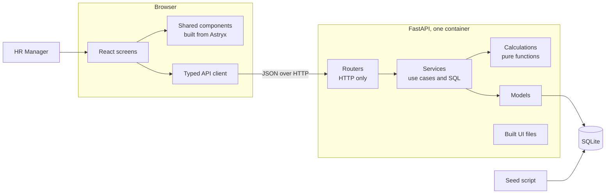
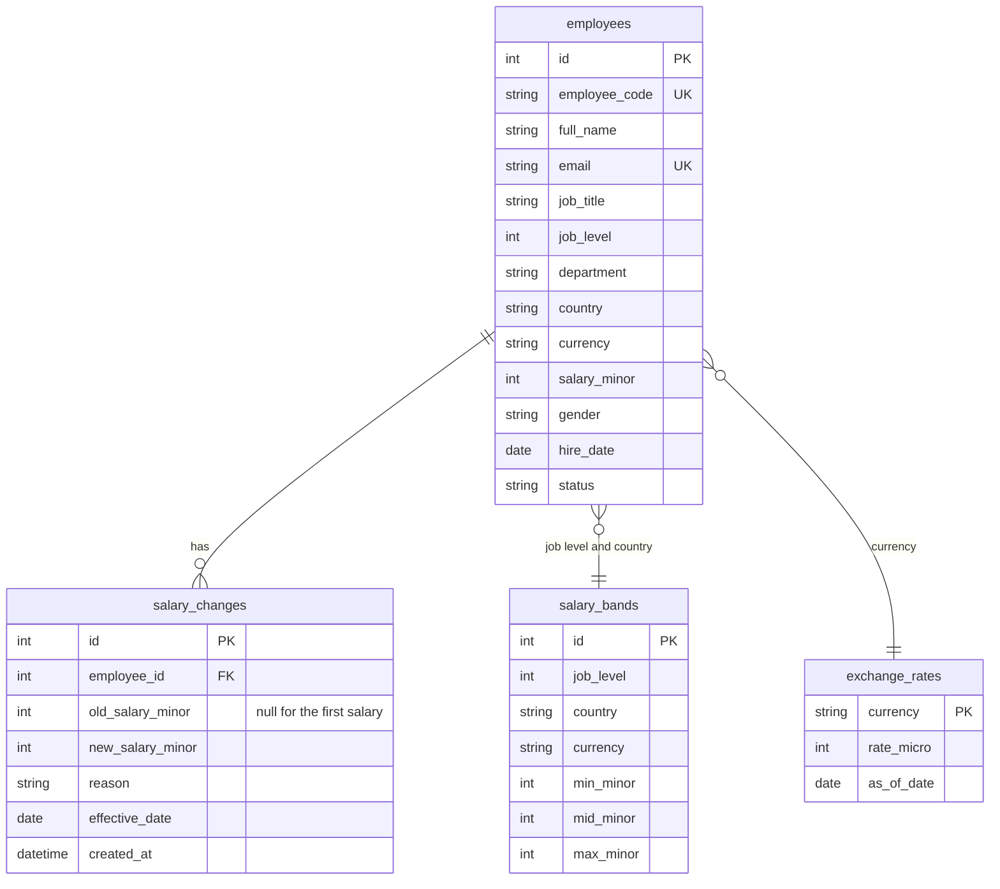

# Architecture

## Diagram

## Layers

| Layer | Responsibility | Rule |
|---|---|---|
| Routers | Parse the request, call a service, shape the response | A router has no query |
| Services | Use cases and database queries | A service does not import from a router |
| Calculations | Money, salary bands, pay gap, salary change rules | No import from the application; no database, network or clock |
| Models | The 4 tables | No business rule |

The dependency direction is: routers, then services, then models. The services also use the calculations.

## Data model

## Main decisions

1. **MVC with a service layer, not a hexagonal architecture.** The domain rules are small. There is one database and one input channel. Ports and repositories add files and no value here.
2. **Pure calculations.** The compa-ratio, the range penetration, the pay gap and the currency conversion are functions with no dependencies. Most unit tests are for these functions, and they run in milliseconds.
3. **Money as integers.** Each amount is an integer in minor units. An exchange rate is an integer in micro-units. No calculation in the API or in SQL uses a floating-point number for money. The UI converts an amount for display and for a form in one place, `lib/money.ts`.
4. **One conversion formula, in two places.** Python and SQL use the same integer formula. A test proves that they agree.
5. **Aggregation in the database.** The group figures, the medians and the lists of outliers are SQL queries. The service adds the group figures (8 rows at most) to get the totals, so a total always equals the sum of its parts. The median uses a window function, because SQLite has no median function.
6. **A salary change is one transaction.** It adds a history row and updates the current salary together. No code changes or deletes a history row.
7. **The system calculates each insight at read time.** A salary change or a band change shows in each insight at once. There is no cache to keep correct.
8. **The clock is an input.** A service gets `today` as an argument. A test gives a fixed date.
9. **A shared component library.** A screen composes shared components. A shared component composes Astryx components. No file writes a color value by hand. A component goes into the library when 2 screens use it.
10. **One container.** FastAPI serves the API and the built UI. The image contains the seeded database, so each start gives the same data.
